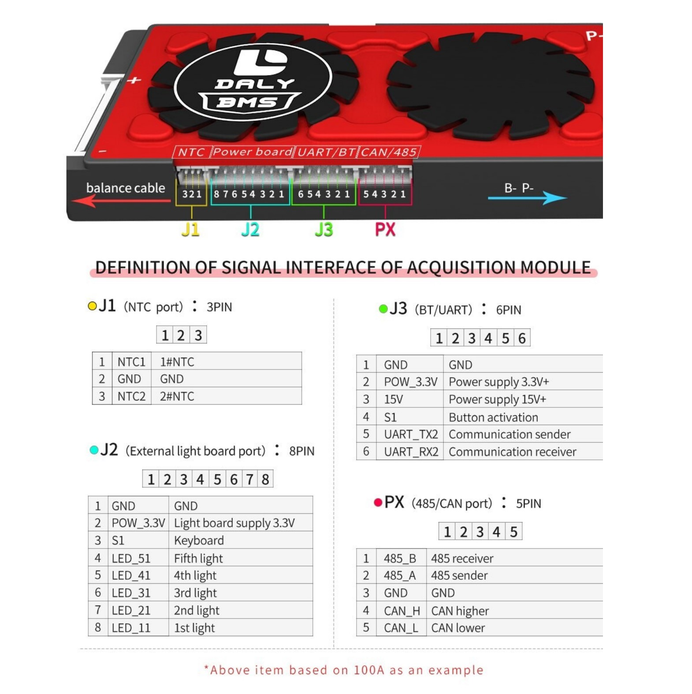
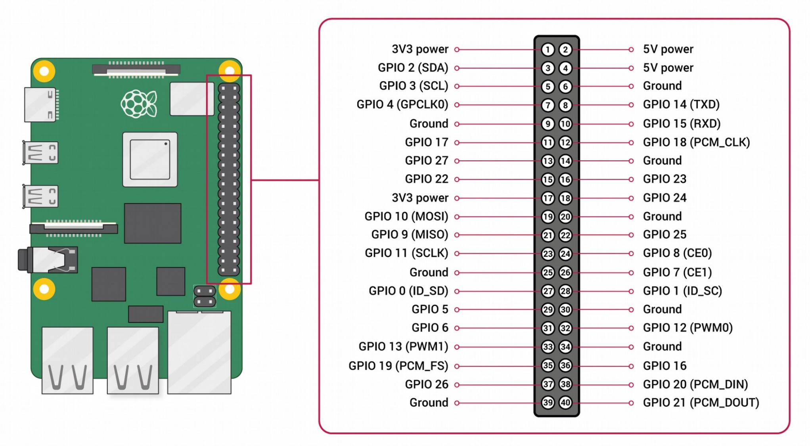

# Daly BMS MQTT and CSV Logger

This script is made in python3 for a raspberry pi to connect to an daly bms.

This connects to a daly bms via uart and reads the data from it. It then sends the data to a mqtt server as well as a csv file on the sd card.

## Requirements
* [Raspberry Pi](https://www.raspberrypi.org/)
* [Daly BMS](https://www.dalybms.com/)

## Installation
* Install [python3](https://www.python.org/downloads/)
* Enable [uart](https://www.raspberrypi.org/documentation/configuration/uart.md) on the raspberry pi 
  * `sudo raspi-config`
  * scroll down to `Interfacing Options`
  * select `P6 Serial`
  * select **No** for `Would you like a login shell to be accessible over serial?`
  * select **Yes** for `Would you like the serial port hardware to be enabled?`

## Connections
Connect the daly bms to the raspberry pi via uart (*Refer to picture below*)

||DALY|Raspberry Pi|
|---|---|---|
|Ground|GND – pin 1 |Ground e.g. pin 9|
|Data 1|UART_TX2 – pin 5|RXD – pin 10|
|Data 2|UART_RX2 – pin 6|TXT – pin 8|

### Pinout

